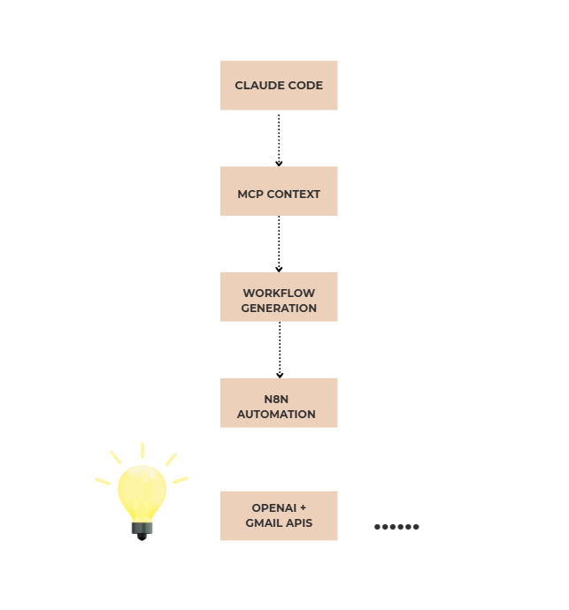
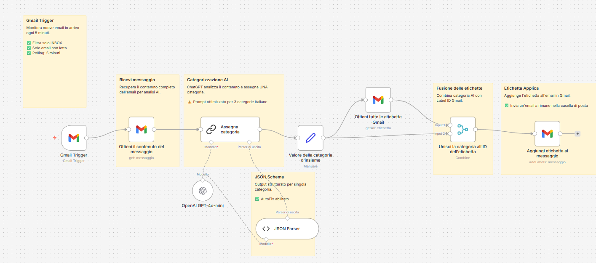
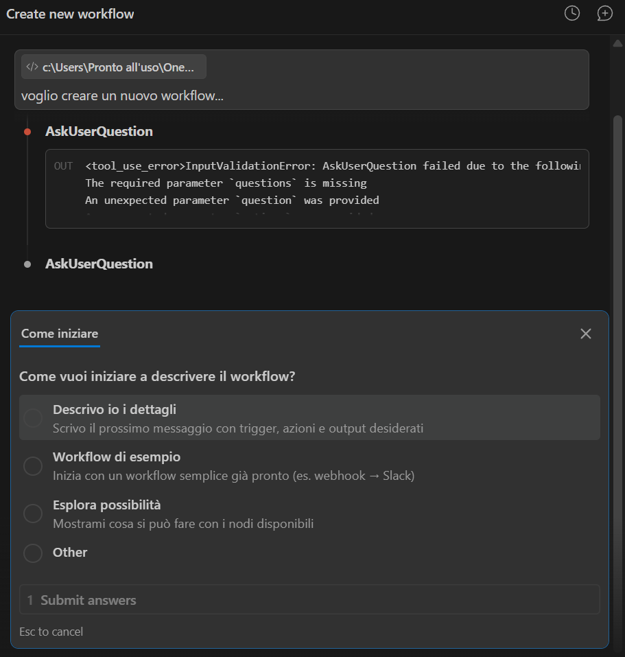

# Claude Code + n8n AI Workflows

## Overview

This project explores AI-assisted workflow development using Claude Code, MCP context integration and n8n automation.

The goal is to transform natural language ideas into functional AI workflows through iterative collaboration between developer and LLMs.

---

## Main Workflow

### Gmail AI Classification Workflow

An intelligent Gmail automation workflow built with n8n and OpenAI APIs that automatically categorizes incoming emails using LLM reasoning and structured outputs.

The system:
- monitors incoming Gmail messages
- retrieves email content
- analyzes emails with GPT-4o-mini
- classifies messages into predefined categories
- applies Gmail labels automatically

Categories:
- High Priority
- Finance & Billing
- Promotions

---

## Technologies

- n8n
- Claude Code
- OpenAI API
- Gmail API
- MCP
- JSON Structured Outputs
- AI-assisted workflow development

---

## AI-Assisted Development Approach

This project was developed through iterative collaboration with Claude Code using contextual documentation and MCP integration.

The workflow generation process included:
- natural language workflow design
- AI-guided automation planning
- structured workflow generation
- iterative debugging and refinement
- testing and validation procedures

The goal was not only to create an automation workflow, but also to explore how LLMs can collaborate with developers during workflow engineering and automation design.

---

## Architecture



---

## Workflow Preview



---

## Claude Code Workflow Generation



---

## Documentation

Additional documentation available in `/docs`:

- setup guide
- testing procedures
- workflow validation
- architecture notes
- AI workflow experimentation

---

## Why I Built This

I’m fascinated by the rapid evolution of AI tooling and AI-assisted development.

This project is part of my experimentation around how LLMs can accelerate workflow engineering, automation design and real-world AI integrations.

The AI ecosystem evolves continuously, with new models, tools and approaches appearing every week, and this dynamic environment is what motivates me to keep experimenting and learning.

---

## Repository Structure

```txt
/workflows
/docs
/screenshots
